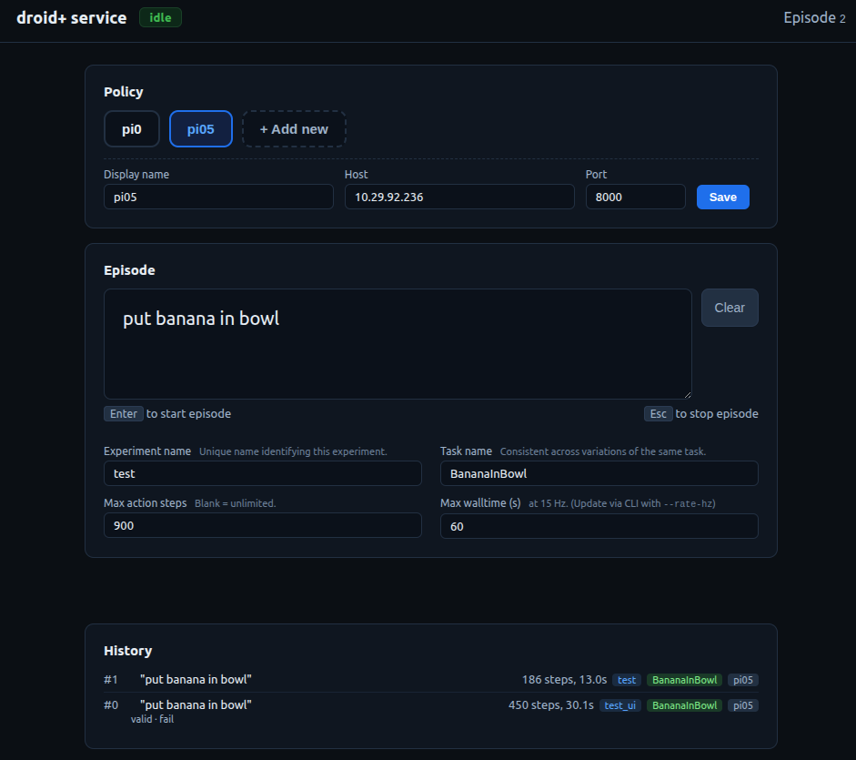

# Policy Evaluation

Run closed-loop policy episodes against a remote policy server. Two entry points share the same recording pipeline (see [Experiment Logging](experiment-logging.md)):

{width=100%}

| Script | Use case |
|---|---|
| `scripts/run_experiment_cli.py` | Scripted / terminal workflow |
| `scripts/run_experiment_ui.py` | Browser interface |

For the `experiments.json` schema used by `--exp` and `--exp-file`, see [Adding New Experiments](adding-experiments.md).

## Run

Bring up the Franka first (see [Bring-up procedure](../README.md#bring-up-procedure)), then use one of:

### CLI

```bash
# From a named preset in experiments/experiments.json
python scripts/run_experiment_cli.py --exp banana_in_bowl

# Ad-hoc instruction
python scripts/run_experiment_cli.py --instruction "pick up the can"

# Batch mode — run every entry in the file sequentially
python scripts/run_experiment_cli.py --exp-file experiments/experiments.json

# Custom output directory
python scripts/run_experiment_cli.py --exp banana_in_bowl --output-dir runs
```

#### Episode Flow (CLI)

1. **SPACE** — start the next episode (begins recording + policy streaming).
2. **ESC** (during episode) — stop the current episode early.
3. Post-episode prompts print to the terminal: `valid?`, `success?`, `score?`, `episode_notes?`. Answering any of them writes the label back to `meta.json`.
4. Loop back to step 1 until all episodes in the batch complete.
5. **Ctrl+C** or ESC at the SPACE prompt — quit.

After each episode the robot auto-homes and the gripper opens. Run directories follow `{output-dir}/{task}_{policy}_{timestamp}/episode_000/…`.

#### Make targets

```bash
make run_experiment_900 INSTRUCTION="pick up the can" NOTES="testing new grasp"
```

#### CLI Reference (`run_experiment_cli.py`)

| Argument | Default | Description |
|----------|---------|-------------|
| `--experiment`, `--exp` | None | Load from `experiments.json` |
| `--experiment-file`, `--exp-file` | None | Batch: run all experiments in file |
| `--task` | "" | Task name (overrides experiment) |
| `--instruction` | "" | Policy instruction (overrides experiment) |
| `--action-step-limit` | -1 | Max steps per episode (-1 = unlimited) |
| `--notes` | "" | Free-form notes saved to metadata |
| `--policy` | `"pi05"` | Policy name (entry in `POLICIES` in `constants.py`) |
| `--policy-host` | from constants | Policy server host (override) |
| `--policy-port` | `8000` | Policy server port (override) |
| `--open-loop-horizon` | `10` | Policy chunk horizon |
| `--rate-hz` | `15.0` | Control loop rate (Hz) |
| `--record-jpeg-quality` | from `constants.py` | JPEG quality for recorded images |
| `--output-dir` | `output` | Base output directory |
| `--dry-run` | off | Run policy without commanding the robot |
| `--no-record` | off | Disable recording (records by default) |

### Web UI

```bash
python scripts/run_experiment_ui.py
python scripts/run_experiment_ui.py --port 54324 --output-dir runs
python scripts/run_experiment_ui.py --policy pi0 --rate-hz 15
```

The server binds to `0.0.0.0`; open `http://localhost:54324` (or `http://<host>:54324` from another machine on the same network) in a browser. Robot init, camera health check, and homing happen at launch.



#### Page layout

1. **Header** — service name, status badge (idle / running), episode counter.
2. **Policy card** — list of policies from `POLICIES` in `constants.py`, plus session-added custom policies. Click to select; an inline editor exposes host / port / display name. Hit **+ Add new** to register a runtime-only URI + host + port.
3. **Episode card** — instruction (required), experiment / task names, `Max action steps` and `Max walltime (s)` (synchronized via `--rate-hz`).
4. **Status area** — live details while an episode is running (elapsed time, current instruction, active policy).
5. **History** — most-recent-first list. Click a row to expand the inline label form.

#### Keyboard shortcuts

| Key | Action |
|---|---|
| <kbd>Enter</kbd> (in instruction) | Start episode |
| <kbd>Esc</kbd> (anywhere) | Stop current episode |
| <kbd>Shift</kbd>+<kbd>Enter</kbd> (in instruction) | Newline |

The launching terminal also accepts <kbd>Esc</kbd> to stop the current episode and <kbd>Ctrl+C</kbd> to quit.

#### Policy editor

The editor is session-scoped — nothing is written back to `constants.py`:

- **Select** a policy → it becomes active for subsequent episodes.
- **Edit** host / port / display name → overrides the `POLICIES` entry for this session only. Changing host or port evicts the cached client so the next episode reconnects to the new endpoint.
- **+ Add new** → register a URI + host + port at runtime. Only the current session knows about it.

The editor is disabled while an episode is running.

#### Label form

Every history row expands to an inline form:

- **Experiment / Task** — edit the name after the fact; writes back to `meta.json`.
- **Valid** (Y/N) — was the episode usable?
- **Success** (Y/N) — did the policy complete the task?
- **Score** — optional numeric.
- **Notes** — freeform string.

Hit **Save** to persist; the UI rewrites `{episode_dir}/meta.json` in place. Labels can be edited any number of times after the episode completes.

#### Persisted fields

The browser saves form state to `localStorage` (key `experiment_service_state_v1`): experiment name, task name, step limit. Survives page refreshes; clearing site data resets them.

#### CLI Reference (`run_experiment_ui.py`)

| Argument | Default | Description |
|----------|---------|-------------|
| `--port` | `54324` | Web server port |
| `--policy` | `"pi05"` | Default policy selected at launch |
| `--open-loop-horizon` | `10` | Policy chunk horizon |
| `--rate-hz` | `15.0` | Control loop rate (Hz) |
| `--jpeg-quality` | `90` | JPEG quality for live camera snapshots |
| `--record-jpeg-quality` | from `constants.py` | JPEG quality for recorded images |
| `--output-dir` | `output` | Base output directory |
| `--dry-run` | off | Run policy without commanding the robot |
| `--record` | on | Record episodes |

## Action step limits

| Task type | Recommended limit | Duration at 15 Hz |
|---|---|---|
| Simple pick-and-place | 450 | ~30 s |
| Standard manipulation | 900 | ~60 s |
| Multi-step tasks | 1200 | ~80 s |
| Complex sequences | 1800 | ~120 s |

## Output Structure

```
{output-dir}/{task}_{policy}_{timestamp}/      # CLI
{output-dir}/ui_{policy}_{timestamp}/          # Web UI
├── episode_000/
│   ├── meta.json
│   ├── steps.jsonl
│   ├── ee_trajectory.json
│   ├── left/000000000.jpg, ...
│   └── wrist/000000000.jpg, ...
├── episode_001/
│   └── ...
└── ...
```

See [Experiment Logging](experiment-logging.md) for the full data format.
