# DROID+ Hardware Setup

This guide covers the hardware components and setup procedure for the DROID+ system. This guide is based on [DROID instructions](https://droid-dataset.github.io/droid/docs/hardware-setup), but simplified for running evaluations using joint position.

## Components

<table>
  <thead>
    <tr>
      <th>Component</th>
      <th>#</th>
      <th>Approx. Cost</th>
      <th>Total</th>
    </tr>
  </thead>
  <tbody>
    <tr><td colspan="4"><strong>Gripper</strong></td></tr>
    <tr><td>M3 10mm Hex Socket Head Cap Screws (wrist camera mount connection)</td><td>1</td><td>$1</td><td>$1</td></tr>
    <tr><td>M3 30mm Hex Socket Head Cap Screws (wrist camera mount to arm)</td><td>2</td><td>$1</td><td>$2</td></tr>
    <tr><td><a href="https://drive.google.com/drive/folders/1k56XVdlfrXCX4iOlFlTlkoTh-2Px6CyD">DROID 3D-printed camera mount files</a> (download separately; not distributed with DROID+)</td><td>1</td><td>$0</td><td>$0</td></tr>
    <tr>
      <td>
        <a href="https://robotiq.com/products/2f85-140-adaptive-robot-gripper">2F-85 Robotiq Gripper kit for UR</a>
        (AGC-UR-KIT-002), including: 
        &emsp;1x 2F-85 Basic Gripper Unit (AGC-GRP-2F85) 
        &emsp;1x End-Effector Coupling Kit (GRP-CPL-062) 
        &emsp;1x 10m Robotiq device cable (CBL-COM2065-10-HF) 
        &emsp;1x USB to RS485 adapter (ACC-ADT-USB-RS485)
      </td>
      <td>1</td>
      <td>$6,000</td>
      <td>$6,000</td>
    </tr>
    <tr><td><a href="https://www.amazon.com/SHNITPWR-Converter-Transformer-100-240V-5-5x2-5mm/dp/B07PWZQ33N">24V, 2A DC Power Supply Adapter</a> (100–240V AC to DC; 5.5x2.5mm DC Tip) for Robotiq gripper</td><td>1</td><td>$17</td><td>$17</td></tr>
    <tr><td colspan="4"><strong>Robot</strong></td></tr>
    <tr><td><a href="https://franka.de/franka-research-3#request-a-quote-fr">Franka Emika Panda (or) Franka Research 3</a></td><td>1</td><td>$35,000</td><td>$35,000</td></tr>
    <tr><td>NUC: Intel NUC 11 (Panther Canyon) i7-1165G7, 32GB RAM, 1TB SSD / NUC 12 Pro (Wall Street Canyon) / NUC 13 Pro (Arena Canyon)</td><td>1</td><td>$700</td><td>$700</td></tr>
    <tr><td colspan="4"><strong>Cameras</strong></td></tr>
    <tr><td><a href="https://store.stereolabs.com/products/zed-mini">Zed Mini</a></td><td>1</td><td>$400</td><td>$400</td></tr>
    <tr><td><a href="https://store.stereolabs.com/en-gb/products/zed-2/">Zed 2i, 2.1mm focal point</a></td><td>2</td><td>$499</td><td>$998</td></tr>
    <tr><td>10m USB 3.1 Cables</td><td>3</td><td>$20</td><td>$60</td></tr>
    <tr><td colspan="4"><strong>Peripherals</strong></td></tr>
    <tr><td><a href="https://www.amazon.com/NETGEAR-Gigabit-Ethernet-Unmanaged-1000Mbps/dp/B00KFD0SMC">Ethernet Switch</a> (for NUC + machine)</td><td>1</td><td>$22</td><td>$22</td></tr>
    <tr><td>Workstation/Laptop of your choosing</td><td>1</td><td>$1,000</td><td>$1,000</td></tr>
    <tr><td>Keyboard/mouse set</td><td>2</td><td>$50</td><td>$100</td></tr>
    <tr><td>Ethernet cable, long</td><td>3</td><td>$20</td><td>$60</td></tr>
    <tr><td colspan="4"><strong>Accessories</strong></td></tr>
    <tr><td>Extension Cord</td><td>1</td><td>$11</td><td>$11</td></tr>
    <tr><td>USB port</td><td>1</td><td>$10</td><td>$10</td></tr>
    <tr><td>Zip Ties</td><td>1</td><td>$25</td><td>$25</td></tr>
    <tr><td>Cable Ties</td><td>1</td><td>$6</td><td>$6</td></tr>
    <tr><td>Chord Wraps</td><td>1</td><td>$18</td><td>$18</td></tr>
    <tr><td>Duct Tape</td><td>1</td><td>$8</td><td>$8</td></tr>
  </tbody>
</table>

## Mount Franka Robot on a table

This guide assumes that you have an existing Franka robot mounted on a table surface. This guide will start with replacing the Franka Panda hand with the Robotiq-2f-85 Gripper.

## Mounting Hand Camera on Robot

In this section, we will specify how to mount the zed mini camera on the Franka robot arm. It will be easier to perform this part of the assembly with the Franka robot arm in a position that you have easy access to the last link of the robot (often referred to as link8).

0. 3D Print the Zed mini camera mount.

1. Secure the Zed Mini camera in the custom mount specified in the shopping list, insert a nut into the hole on the back of the mount. Insert the 10mm screw on the other side, and tighten the screw in until the attachment is tight.

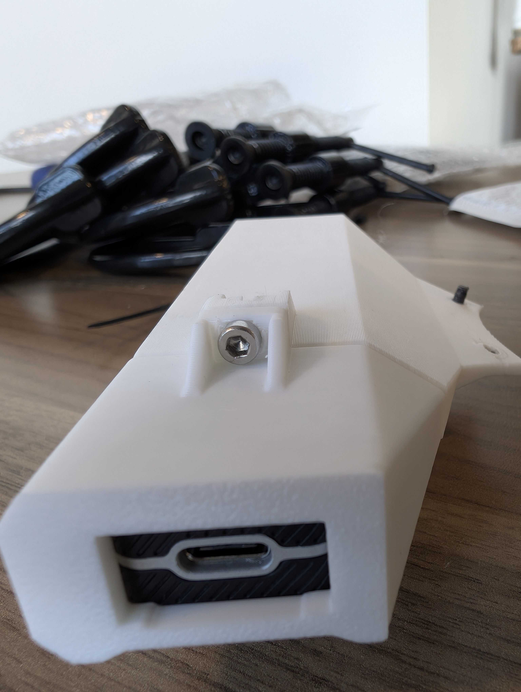

2. Remove the back two screws in the Franka wrist. See picture.

> [!NOTE]
>**⚠️ Be extremely careful and slow here! These screws have loctite and may shear off and/or tend to be stripped.**

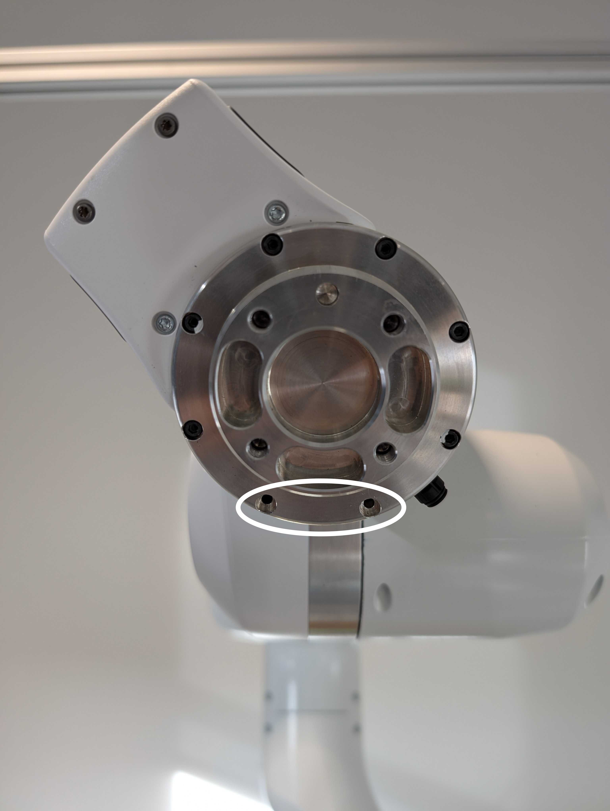

3. Use 2x M3 30mm screws to attach the hand camera to the gripper, with the camera facing down (**Important:** these are different from the default screws that come with the arm, do not use those).

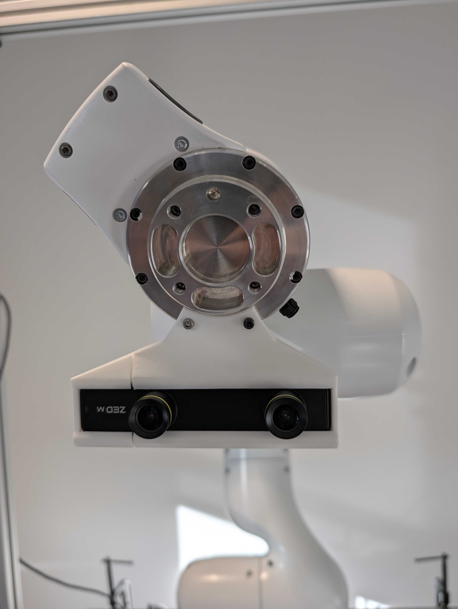

## Mounting Robotiq Gripper on Robot

In this section, we will first prepare the Robotiq gripper wiring as it is non-trivial. Following this we will specify how to mount the gripper on the arm.

### Preparing Wires

Prepare and connect the Robotiq cable by following the upstream
[DROID gripper-wiring instructions](https://droid-dataset.github.io/droid/hardware-setup/assembly#preparing-wires).
Those instructions provide the detailed wire mapping, assembly photographs, and
strain-relief procedure.

Before powering the gripper, inspect every terminal for a secure connection and
make sure the cable is supported so motion cannot pull on the exposed
conductors. Follow the Robotiq documentation and your lab's electrical-safety
procedures if they differ from the upstream guide.

The gripper wire bundle will look like this:

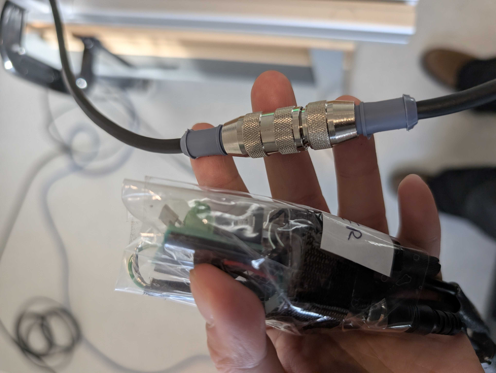

### Mount Procedure

1. Mount gripper plate onto Franka wrist. Use the four large screws to screw the gripper mount plate onto the gripper. The camera mount should be between the mount plate and the gripper. The protruding wire should be to the right of the robot. Refer to the picture for orientation.

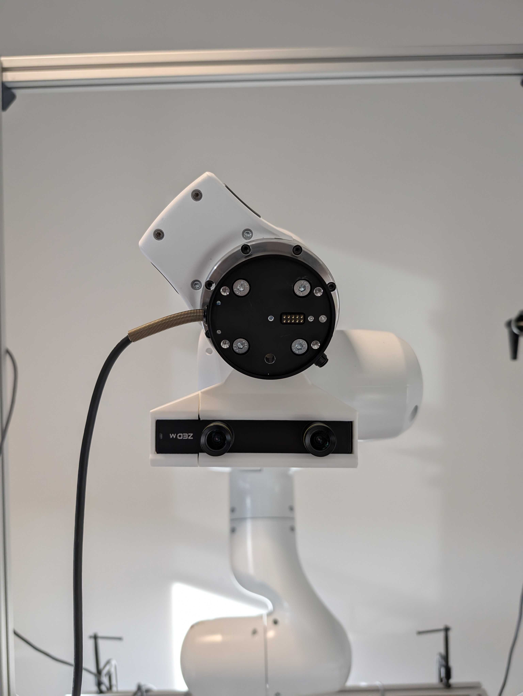

1. Align the Robotiq gripper with the metal pins like the images below. Then, use the long screws to attach the gripper in all four corners. Note the orientation of the gripper relative to the wire and camera.

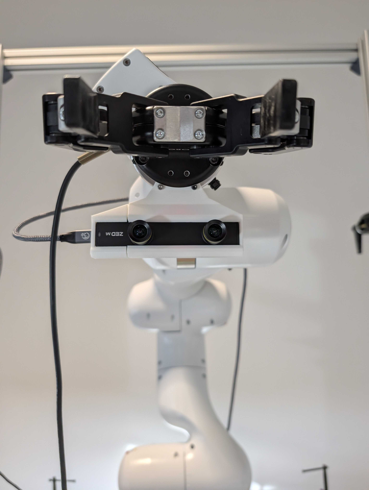
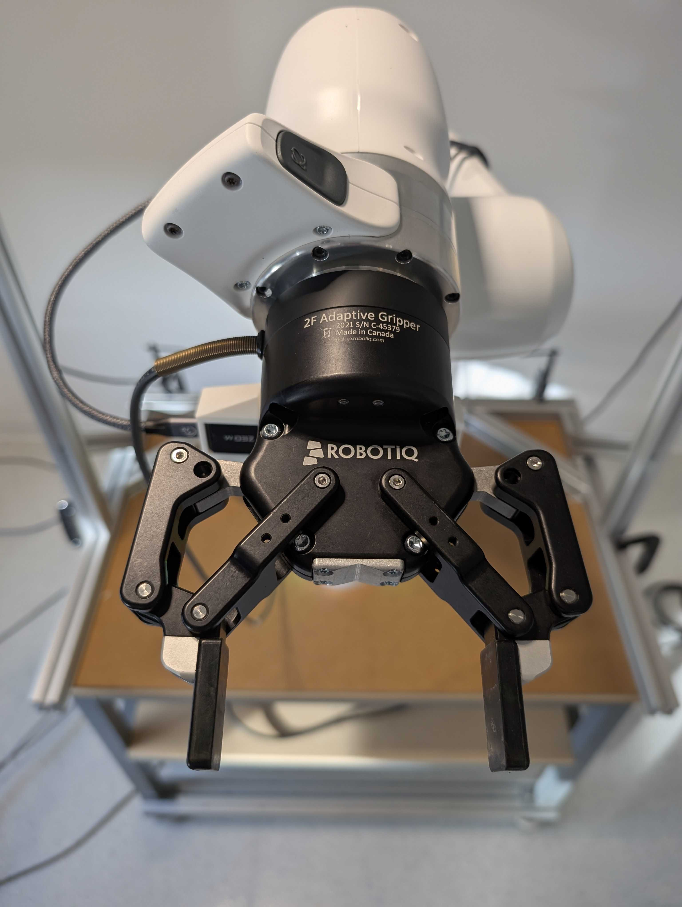

3. Place a small piece of thick Velcro (soft side) over the light on the gripper. Otherwise, it will shine into the camera.

## Camera Chassis Setup

Below are images showing the camera chassis and camera placement. Feel free to randomize the external camera placement.

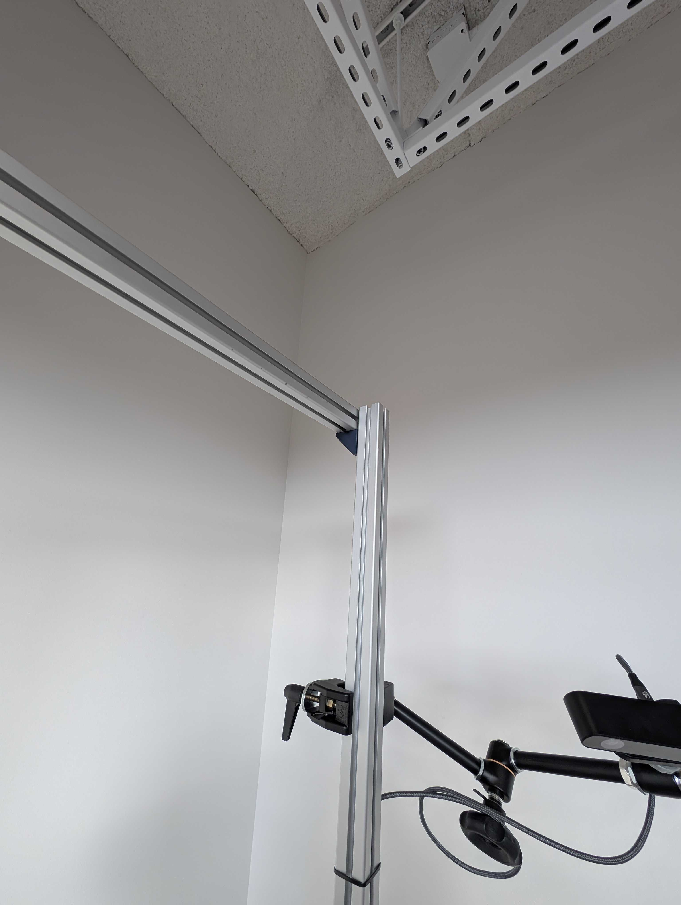
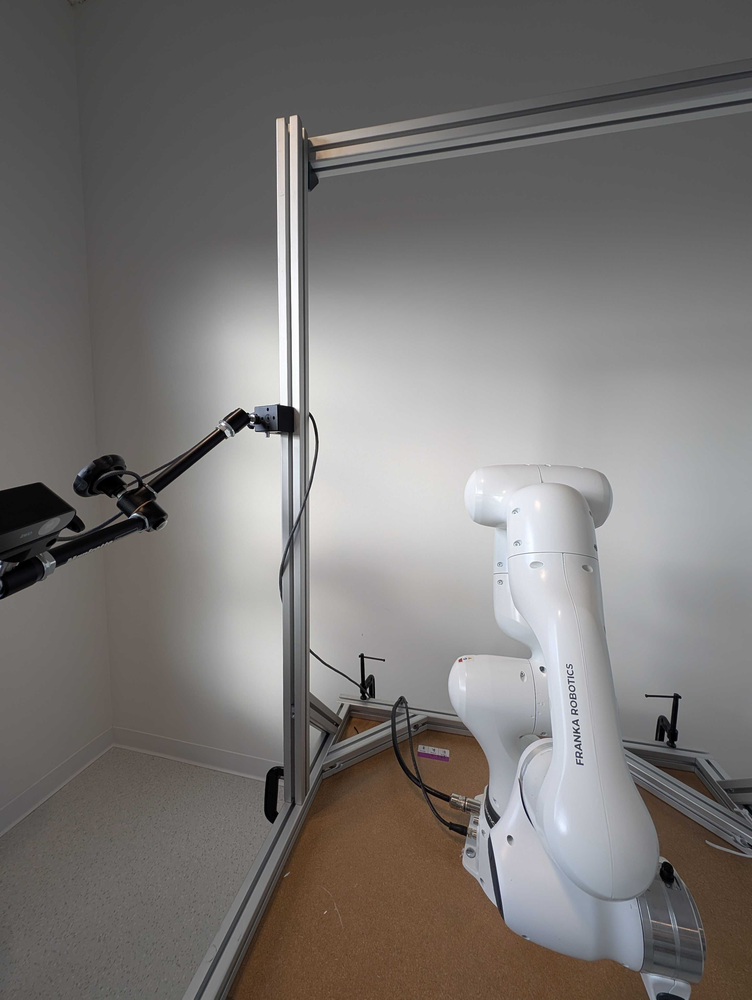
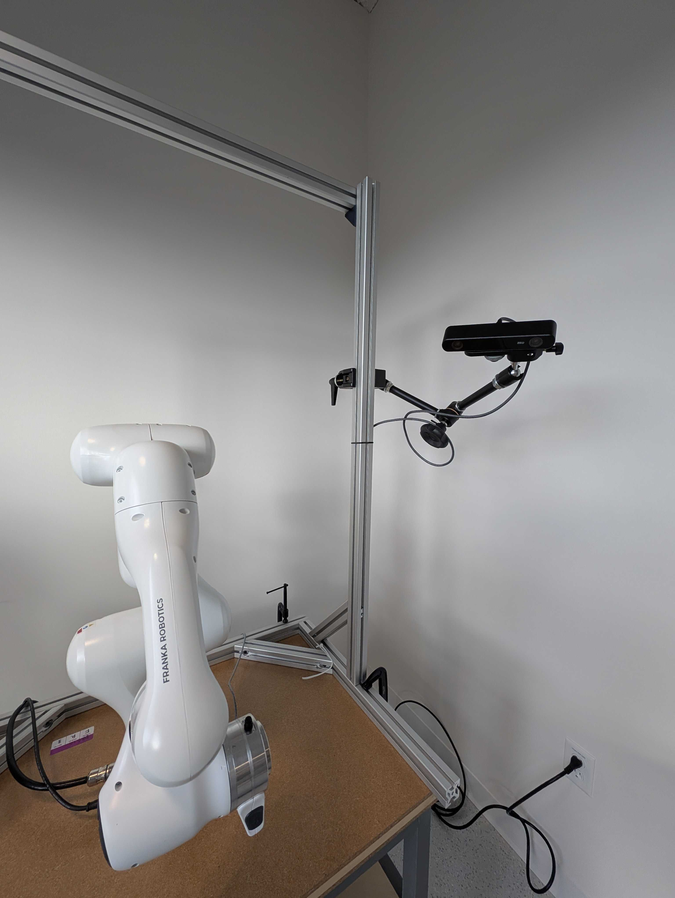
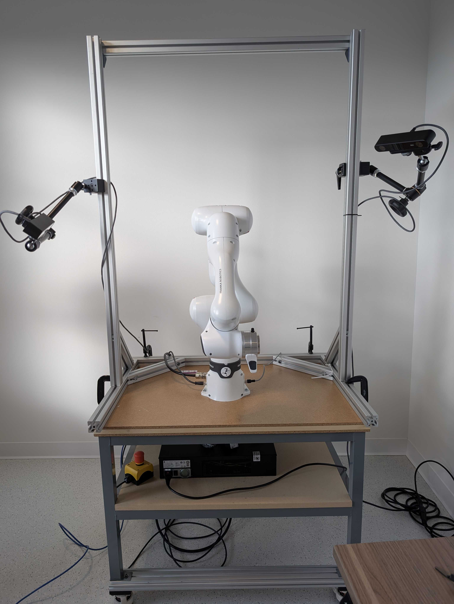

## Wiring

1. Plug all camera USB wires directly into the workstation.

## Next Steps

For software configuration (NUC flashing, workstation setup, camera serial numbers), see [Software Setup](software-setup.md).
