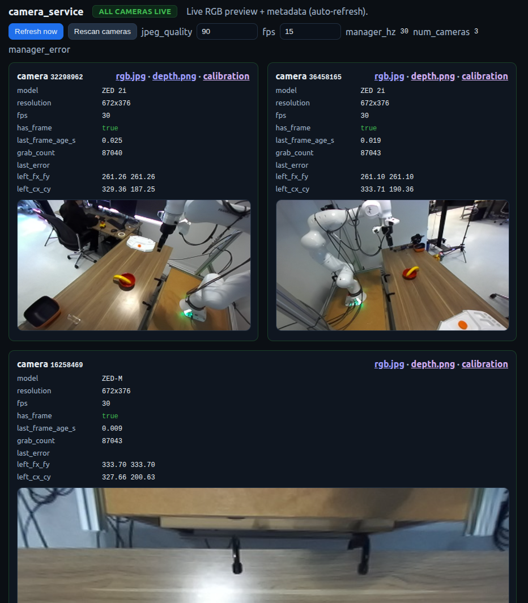

# DROID+ Software Setup

This guide covers software configuration for the DROID+ system. For physical hardware assembly, see [Hardware Setup](hardware-setup.md).

## NUC Flashing Procedure

The NUC machine, used to interface with Franka, must be installed with a realtime kernel. Follow instructions here:  [PREEMPT_RT Kernel Build Guide (Ubuntu 22.04)](rt-kernel-instructions.md)

## Workstation Setup

Install Ubuntu 22.04 or 24.04

Follow installation instructions in this repo's [README](../README.md#installation).

## Camera Serial Numbers

Each ZED camera has a unique hardware serial number. The system uses these serials to identify which camera is which (wrist vs. left vs. right).
The serial number is printed on a label on the side or bottom of the camera.

Set the camera serials in your environment:

```bash
export WRIST_CAMERA_SERIAL=<wrist-zed-serial>
export LEFT_CAMERA_SERIAL=<left-zed-serial>
export RIGHT_CAMERA_SERIAL=<right-zed-serial>
```

### Finding serial numbers

If you swap a camera, find the new serial by plugging it in and running:

```bash
python -c "import pyzed.sl as sl; print([(d.serial_number, d.camera_model) for d in sl.Camera.get_device_list()])"
```

Then set the corresponding environment variable before launching services or
experiment scripts.

## Network Configuration

Network addresses can be configured with environment variables. The defaults
are localhost so the repository does not ship lab-specific addresses.

### NUC IP

The Intel NUC runs `franky_service` (Franka robot control) and is connected via Ethernet. Set its host/IP with `NUC_IP`:

```bash
export NUC_IP=<franky-service-host>
```

The franky service URL is derived automatically: `http://{NUC_IP}:54321`.

To find the NUC's IP, run `ip addr` on the NUC or check your router's DHCP leases.

### Service URLs

The camera and gripper services run on the workstation (localhost). The service URLs are derived from `SERVICES_IP` in `constants.py`:

| Service | Port | URL |
|---------|------|-----|
| franky_service (NUC) | 54321 | `http://{NUC_IP}:54321` |
| camera_service (workstation) | 54322 | `http://{SERVICES_IP}:54322` |
| gripper_service (workstation) | 54323 | `http://{SERVICES_IP}:54323` |

`camera_service` serves a live dashboard at its root URL — open it in a browser to verify each camera is streaming and identify which serial maps to which role:



### Policy Servers

Policy servers (e.g., OpenPI) can be configured with environment variables:

```bash
export POLICY_NAME=pi05
export POLICY_HOST=<policy-server-host>
export POLICY_PORT=8000
```

Then use it with:

```bash
--policy pi05
```

You can also override the host/port on the command line:

```bash
--policy-host <policy-server-host> --policy-port 9000
```
