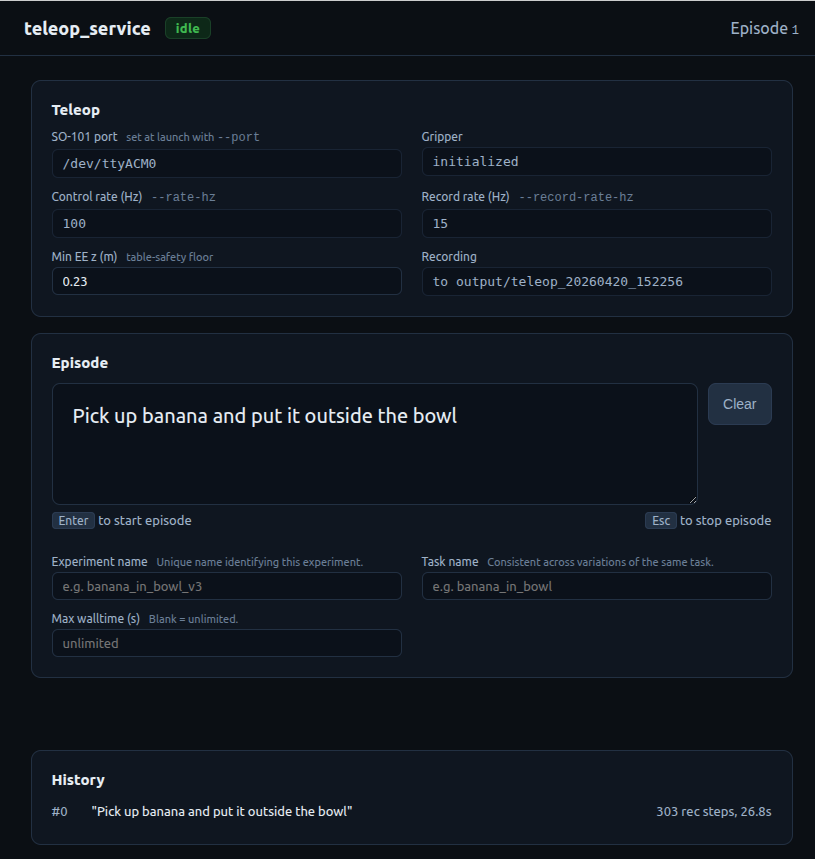

# Teleoperation

Teleoperate the Franka using a leader arm. Two devices are supported:

| `--leader` | Device | DoF | Mapping |
|---|---|---|---|
| `so101` (default) | [SO-101 leader arm](https://github.com/jess-moss/so-arm100) | 5 + gripper | Partial — drives Franka j0/j1/j3/j5/j6, the rest stay at home |
| `gello` | 7-DoF [GELLO](https://wuphilipp.github.io/gello_site/) (Franka variant) | 7 + gripper | 1:1 — GELLO is a kinematic replica, so joint targets pass through directly |

Records data in the same format as the experiment runners.

{width=100%}

## Prerequisites

### Hardware

- Franka robot arm, brought up (see [Hardware Setup](hardware-setup.md))
- A leader arm connected via USB (SO-101 or GELLO)
- Robotiq 2F-85 gripper (optional — use `--no-gripper` to skip)

### Software

```bash
cd /path/to/droid-plus

# SO-101: LeRobot 0.4.x with Feetech support + FK safety dependencies
pip install -e ".[teleop,analysis]"

# GELLO: Dynamixel SDK + FK safety dependencies (LeRobot not required)
pip install -e ".[gello,analysis]"
```

### Finding the leader serial port

The SO-101 typically enumerates as `/dev/ttyACM0` (the default); GELLO uses an FTDI or
OpenRB-150 converter and enumerates as `/dev/ttyUSB0`.

```bash
ls /dev/ttyACM* /dev/ttyUSB*

# Stable, reboot-proof names — prefer these:
ls -l /dev/serial/by-id/

# If multiple devices:
dmesg | grep -E 'ttyACM|ttyUSB' | tail -5
```

Pass the `by-id` path to `--port` so the device survives re-enumeration:

```bash
python scripts/run_teleop_cli.py --leader gello \
  --port /dev/serial/by-id/usb-FTDI_USB__-__Serial_Converter_XXXXXXXX-if00-port0
```

The port must be readable by your user — add yourself to the `dialout` group if not
(`sudo usermod -aG dialout $USER`, then log out and back in).

## GELLO calibration

GELLO commands **absolute** joint targets, so its assembly offsets must be measured
before first use. The built-in defaults match the pre-assembled 7-DoF "Franka GELLO";
verify them rather than assuming them.

1. Hold or park the GELLO in the calibration pose — the pose the Franka reaches at
   joint angles `0, 0, 0, -π/2, 0, π/2, 0` — with the gripper trigger fully released.
2. Measure and save:

   ```bash
   python scripts/gello_calibrate.py --port /dev/ttyUSB0 --out gello_config.json
   ```

3. Verify signs and ranges by streaming the mapped joint angles. Move one joint at a
   time: each should move in the same direction and by the same amount as the
   corresponding Franka joint. A joint that moves backwards needs its sign flipped in
   `joint_signs`.

   ```bash
   python scripts/gello_calibrate.py --check --gello-config gello_config.json
   ```

4. Point teleop at the config with `--gello-config gello_config.json`, or export
   `GELLO_CONFIG=/abs/path/gello_config.json` to make it the default.

`gello_config.json` fields:

| Field | Description |
|---|---|
| `port`, `baudrate` | Serial device and Dynamixel baudrate (`57600`) |
| `joint_signs` | Per-joint motor direction, `+1` / `-1` |
| `joint_offsets` | Assembly offsets (rad), measured after the sign flip |
| `gripper`, `gripper_range_rad` | Trigger presence and its `(closed, open)` raw span |
| `max_joint_speed_rad_s` | Command slew limit; `<= 0` disables rate limiting |
| `smoothing_alpha` | Exponential smoothing on the pose estimate; `1.0` disables it |

### Safety behaviour specific to GELLO

- **Joint limits** — targets are clipped to the FR3 joint position limits.
- **Slew limit** — commands ramp at `max_joint_speed_rad_s` (default 2.0 rad/s) so a
  bus glitch or a large pose mismatch cannot produce a step command.
- **Alignment gate** — before each episode the runner waits until every joint of the
  leader is within `--align-tol` (default 0.25 rad) of the robot's measured pose, then
  seeds the slew limiter from the robot's pose. Skip it with `--no-align-check`.
- **Torque off** — the servos are always left back-drivable.

The FK-based `--min-z` table clamp applies to both leaders.

## Run

Bring up the Franka first (see [Bring-up procedure](../README.md#bring-up-procedure)), then use one of:

### CLI

```bash
python scripts/run_teleop_cli.py
python scripts/run_teleop_cli.py --leader gello --gello-config gello_config.json
python scripts/run_teleop_cli.py --port /dev/ttyACM1
python scripts/run_teleop_cli.py --no-gripper
python scripts/run_teleop_cli.py --no-record
python scripts/run_teleop_cli.py --task "pick_banana" --notes "first attempt"
```

#### Episode Flow (CLI)

1. **SPACE** — start an episode (begins recording + streaming)
2. Move the leader to match the robot's pose if the alignment gate is waiting
3. **ESC** — stop the current episode
4. Post-episode prompts: `valid?`, `success?`, `score?`, `episode_notes?`
5. Loop back to step 1 for the next episode
6. **Ctrl+C** or ESC at the SPACE prompt — quit

Episodes are saved as `output/{task_}teleop_{timestamp}/episode_000/`, `episode_001/`, etc.

#### CLI Reference (`run_teleop_cli.py`)

| Argument | Default | Description |
|----------|---------|-------------|
| `--leader` | `so101` | Leader device: `so101` or `gello` |
| `--port` | `/dev/ttyACM0` (so101), `/dev/ttyUSB0` (gello) | Leader serial port |
| `--gello-config` | `$GELLO_CONFIG`, else built-in defaults | GELLO calibration JSON |
| `--gello-max-speed` | `2.0` | GELLO command slew limit (rad/s); `<=0` disables |
| `--align-tol` | `0.25` | Max per-joint leader/robot mismatch (rad) before an episode starts |
| `--no-align-check` | off | Skip the pose alignment gate |
| `--franky-service-url` | from `constants.py` | Franky service URL (URDF fetch) |
| `--no-gripper` | off | Skip gripper initialization |
| `--rate-hz` | `100.0` | Control loop rate (Hz) |
| `--min-z` | `0.23` | Min EE Z height in meters (table safety) |
| `--no-record` | off | Disable recording (records by default) |
| `--record-rate-hz` | `15.0` | Recording rate (Hz) — images captured at this rate |
| `--record-jpeg-quality` | `RECORD_JPEG_QUALITY` (constants.py) | JPEG quality for recorded images |
| `--output-dir` | `output` | Base output directory |
| `--task` | "" | Task name for metadata and output directory |
| `--notes` | "" | Free-form notes saved to metadata |
| `--dry-run` | off | Read the leader but don't command the robot or gripper |

### Web UI

```bash
python scripts/run_teleop_ui.py
python scripts/run_teleop_ui.py --leader gello --gello-config gello_config.json
python scripts/run_teleop_ui.py --port /dev/ttyACM1 --web-port 54325
python scripts/run_teleop_ui.py --output-dir runs --task pick_banana
```

The server binds to `0.0.0.0`; open `http://localhost:54325` (or `http://<host>:54325` from another machine on the same network) in a browser. The leader arm is connected at launch, so the first episode is ready to start as soon as the page loads.



#### Page layout

1. **Header** — service name, status badge (idle / aligning / running), episode counter.
2. **Teleop card** — session settings resolved at launch: leader device and port (read-only), control rate Hz, record rate Hz, recording output dir. Only `Min EE z` is editable between episodes.
3. **Episode card** — optional instruction, experiment / task names, max walltime (blank = unlimited).
4. **Status area** — live details while an episode is aligning or running (elapsed time, current instruction).
5. **History** — most-recent-first list. Click a row to expand the inline label form.

#### Keyboard shortcuts

| Key | Action |
|---|---|
| <kbd>Enter</kbd> (in instruction) | Start episode |
| <kbd>Esc</kbd> (anywhere) | Stop current episode |
| <kbd>Shift</kbd>+<kbd>Enter</kbd> (in instruction) | Newline |

The launching terminal also accepts <kbd>Esc</kbd> to stop the current episode and <kbd>Ctrl+C</kbd> to quit.

#### Editing min-z mid-session

The safety z floor can be updated between episodes directly in the Teleop card — the UI `POST`s to `/min_z` and the new value takes effect on the next episode. Updates are rejected while an episode is running (HTTP 409).

#### Label form

Every history row expands to a form for:

- **Experiment / Task** — edit after the fact; writes back to `meta.json`.
- **Valid** (Y/N) — was the episode usable?
- **Success** (Y/N) — did the demonstration succeed?
- **Score** — optional numeric.
- **Notes** — freeform string.

Hit **Save** to persist; the UI rewrites `{episode_dir}/meta.json` in place. Labels can be edited any number of times after the episode completes.

#### Persisted fields

The browser saves `experiment_service` / `teleop_service` form state to `localStorage` (key `teleop_service_state_v1`): experiment name, task name, max walltime. These survive page refreshes; clearing site data resets them.

#### CLI Reference (`run_teleop_ui.py`)

| Argument | Default | Description |
|----------|---------|-------------|
| `--web-port` | `54325` | Web server port |
| `--port` | `/dev/ttyACM0` | SO-101 serial port |
| `--franky-service-url` | from `constants.py` | Franky service URL (URDF fetch) |
| `--no-gripper` | off | Skip gripper initialization |
| `--rate-hz` | `100.0` | Control loop rate (Hz) |
| `--min-z` | `0.23` | Initial safety z floor (editable in UI) |
| `--record-rate-hz` | `15.0` | Recording rate (Hz) |
| `--record-jpeg-quality` | from `constants.py` | JPEG quality for recorded images |
| `--output-dir` | `output` | Base output directory |
| `--task` | "" | Task name used in the run directory |
| `--dry-run` | off | Read SO-101 but don't command the robot or gripper |

### Recording

Records by default at 15 Hz (configurable via `--record-rate-hz`) while the control loop runs at 100 Hz. Each recorded step captures:

- **All 3 cameras** (left, wrist, right)
- **State**: measured joint positions/velocities + gripper position
- **Action**: commanded joint positions + gripper command

Data format is identical to the experiment runners — see [Experiment Logging](experiment-logging.md).

## Joint Mapping: SO-101 → Franka

The 5-DoF SO-101 maps to a subset of the 7-DoF Franka. Joints j2 and j4 stay at home (0.0).

Franka home position:
```
[0.0, -0.40, 0.0, -1.9, 0.0, 1.5, 0.0]
 j0    j1    j2    j3   j4   j5   j6
```

| SO-101 Joint | Clip Range | Franka Joint | Mapping |
|---|---|---|---|
| Shoulder Pan (0) | ±45° | j0 | `-so101[0]` |
| Shoulder Lift (1) | -60° to +90° | j1 | `so101[1]` |
| Elbow Flex (2) | -80° to +80° | j3 | `-π/2 - so101[2]` |
| Wrist Flex (3) | unclamped | j5 | `-so101[3] + π` |
| Wrist Roll (4) | unclamped | j6 | `-so101[4]` |

### Gripper Mapping

SO-101 gripper angle (0–90°) maps linearly to Robotiq position (0–255 bits):

| SO-101 | Robotiq | State |
|---|---|---|
| 0° | 255 | Closed |
| 90° | 0 | Open |

Commands sent only when position changes by >2 bits.

## Safety

### Table Collision Avoidance

FK (Pinocchio + URDF) checks that commanded configurations keep EE above `--min-z` (default 0.23m):

1. **Partial revert**: joints 1 and 3 reverted to last safe values
2. **Full revert**: entire configuration reverts if partial fix insufficient

### Joint Clipping

SO-101 values clipped to conservative ranges before mapping (see table above).

## Troubleshooting

| Problem | Fix |
|---|---|
| No `/dev/ttyACM*` | Check USB connection, try different port |
| Permission denied | `sudo chmod 666 /dev/ttyACM0` or add user to `dialout` group |
| Gripper not responding | Check 24V adapter, check `make gripper_service`, or use `--no-gripper` |
| Robot doesn't move | Verify FCI activated in Franka desk, franky_service running |
| `[safety] EE z=... reverting` | Move leader arm up, or adjust `--min-z` |
